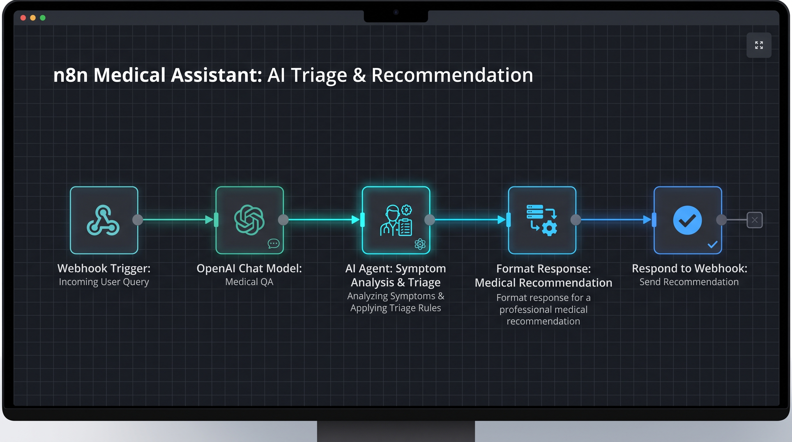
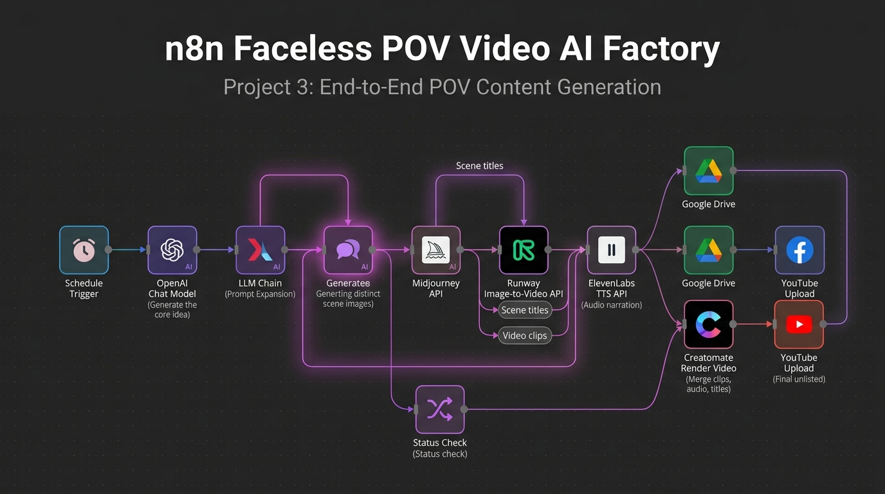
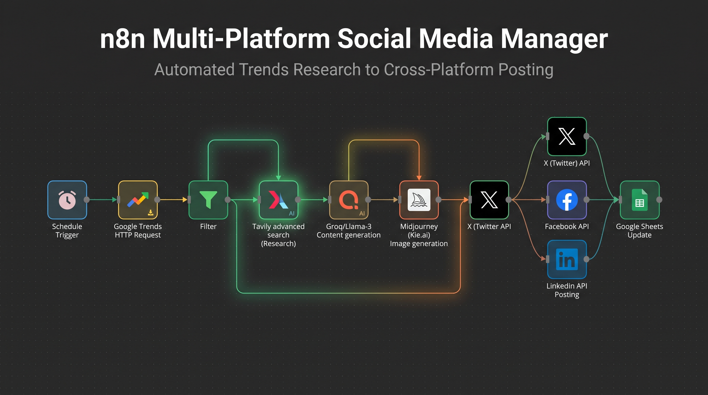
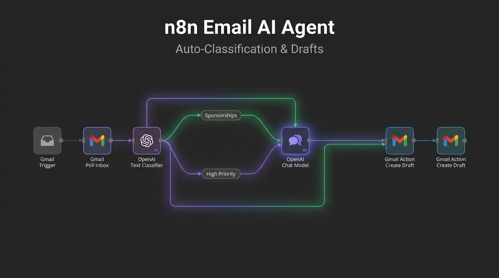
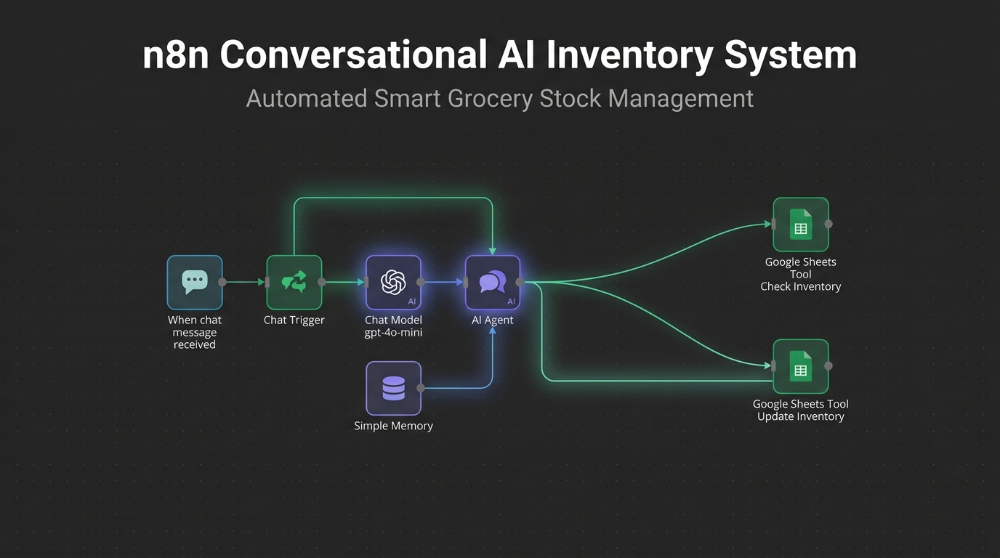
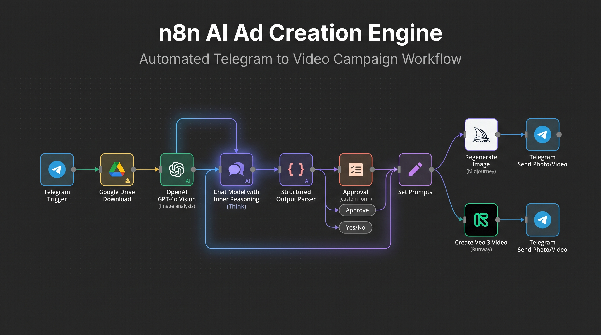

# N8N Workflow Hub

> A curated portfolio of sanitized n8n automations for AI content, RAG assistants, inbox ops, and video workflows.

## What this is

This repository is built to look and feel like a real automation portfolio, not a raw export dump. It organizes your best workflows into a clean structure, adds import guidance, and includes profile-ready documentation.

## Quick view

- AI content automation and multi-platform posting
- RAG pipeline and chatbot systems
- Email and inventory assistants
- Veo3 and video publishing workflows
- Approval-based creative generation
- GitHub profile assets and documentation

## Featured workflows

| Area | What it does |
| --- | --- |
| Content | Social trend research and multi-channel publishing |
| Video | Ad creative, Veo3 prompts, POV generation, and publishing |
| RAG | Google Drive ingestion into Pinecone with chat support |
| Ops | Email triage and inventory updates |
| Assistant | Webhook-based AI assistant workflow |

## Repository map

| Folder | Purpose |
| --- | --- |
| [workflows/content](workflows/content) | Trend research and social content automation |
| [workflows/video](workflows/video) | Ad creation and video generation pipelines |
| [workflows/rag](workflows/rag) | Knowledge base and chatbot workflows |
| [workflows/ops](workflows/ops) | Inbox and inventory automations |
| [workflows/assistants](workflows/assistants) | Standalone AI assistant flows |
| [docs](docs) | Catalog, import, security, and profile docs |

## Gallery

The images in [assets](assets) are preview and branding visuals for the repo.

<table>
	<tr>
		<td></td>
		<td></td>
		<td></td>
	</tr>
	<tr>
		<td></td>
		<td></td>
		<td></td>
	</tr>
	<tr>
		<td></td>
		<td></td>
		<td></td>
	</tr>
</table>

## How to use

1. Open the workflow you want from the correct category folder.
2. Import it into your n8n instance.
3. Reconnect credentials and replace any placeholder values.
4. Follow [docs/IMPORT_GUIDE.md](docs/IMPORT_GUIDE.md) before enabling the flow.

## Documentation

- [Workflow catalog](docs/WORKFLOW_CATALOG.md)
- [Workflow index](workflows/INDEX.md)
- [Import guide](docs/IMPORT_GUIDE.md)
- [GitHub profile audit](docs/PROFILE_AUDIT.md)
- [GitHub profile README draft](docs/GITHUB_PROFILE_README.md)
- [Security notes](docs/SECURITY_NOTES.md)

## Important note

Several source workflows include credential references and API placeholders. Keep secrets outside the exported JSON and use n8n credentials or environment variables when importing.

## GitHub positioning

Use the profile README draft in this repo as the basis for your GitHub profile repository so your public profile immediately shows your automation focus, featured work, and contact points.
